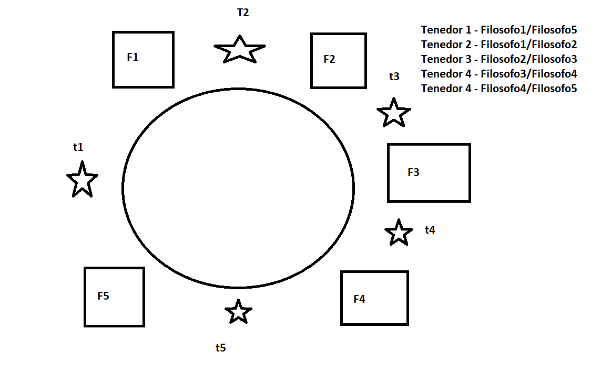

# Problema de los Filósofos Comensales

## Escenario
- **Cinco Filósofos**: Están sentados alrededor de una mesa circular.
- **Actividades**: Los filósofos alternan entre dos actividades: comer y pensar.
- **Fideos y Tenedores**: Cada filósofo tiene un plato de fideos y un tenedor a su izquierda.

## Reglas para Comer
- **Necesidad de Dos Tenedores**: Para comer los fideos, un filósofo necesita dos tenedores.
- **Acceso a los Tenedores**: Cada filósofo solo puede tomar el tenedor a su izquierda y el de su derecha.
- **Espera por el Segundo Tenedor**: Si un filósofo toma un tenedor y el otro está ocupado, permanecerá esperando con el tenedor en la mano hasta que pueda tomar el segundo tenedor.
- **Comienzo de la Comida**: Solo cuando un filósofo tiene ambos tenedores, puede comenzar a comer.

## Estado de Pensamiento
- **Pensando**: Los filósofos que no están comiendo ni tienen un tenedor en la mano están pensando.

## Objetivos del Problema
- Simular el comportamiento de los filósofos.
- Evitar situaciones de bloqueo mutuo (deadlocks) donde todos los filósofos tienen un tenedor y están esperando por el otro.
- Garantizar que todos los filósofos puedan comer eventualmente.

